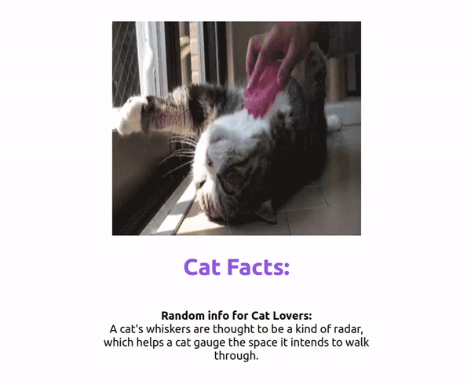

# CuteCat-Facts-Spinner-App

## Exercise Course-Module 3 - Intro Single Page Application (SPA) - HTML/CSS/JavaScript/React.js

created at 16.2.23;

Created an app that fetches and renders new Cat-Facts and a cute Cat-Image every time the browser is refreshed by making an API call using useEffect when the component is rendered.
Created a [FetchDataComponent.js](src/components/FetchDataComponent.js) inside the components folder for fetching the data and a [FetchingImageComponent.js](src/components/FetchingImageComponent.jsx) for fetching an image from 2 different endpoints. Wrote functions to make the api calls, using `UseEffect` and display the fetched data using `useState`.

There is also a spinner conditionally rendered when the `FetchDataComponent` and the `FetchingImageComponent` is loading the data by using a ternary operator.

### My Version:

